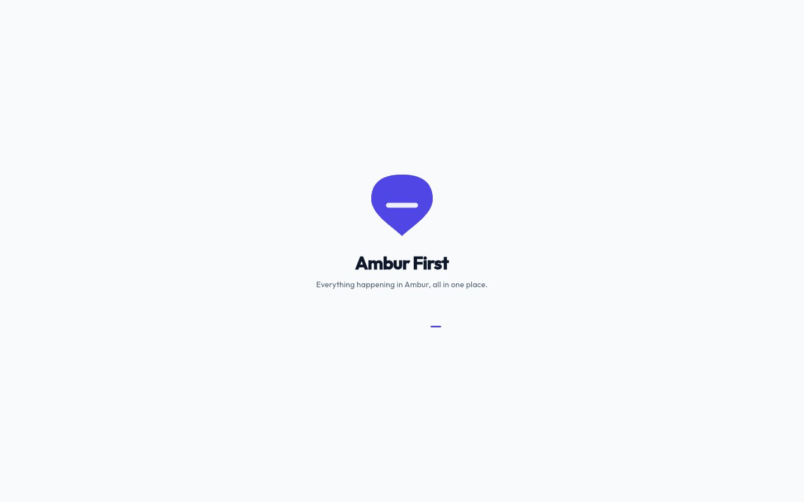
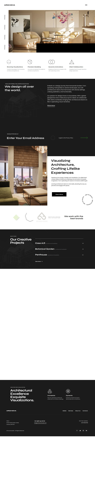

# UX Portfolio — Abdus Saboor Danish

A collection of product design work: end-to-end UX case studies, shipped products, and design exercises.

> **Note on this repo:** these write-ups were drafted from the design files and running apps themselves (problem framing, process, and outcomes inferred from what's visible in each project). Descriptions should be reviewed and corrected where they don't match what actually happened.

## Shipped products

Real products designed and built end-to-end — currently in use or in active development.

| Project | What it is | Case study |
|---|---|---|
|  | **Fifty By Ashhar** — bespoke leather footwear brand: storefront, admin dashboard, and a live ops/workshop app | [View case study](projects/fifty-by-ashhar.md) |
|  | **Bulava.to** — luxury digital wedding invitation platform, with client site and admin portal | [View case study](projects/bulava.md) |
|  | **Ambur First** — hyperlocal community app for the town of Ambur | [View case study](projects/ambur-first.md) |

## UX case studies & design work

| Project | What it is | Case study |
|---|---|---|
|  | **REFREST** — grocery delivery app; full process from persona to hi-fi UI | [View case study](projects/refrest.md) |
|  | **JOBABLE** — job search & application platform, web + mobile | [View case study](projects/jobable.md) |
|  | **Jones Road UX Audit** — heatmap-based UX audit & redesign exercise | [View case study](projects/jones-road-audit.md) |
|  | **ARCHOVA** — architectural visualization studio website | [View case study](projects/archova.md) |
|  | **Vanscape** — landscaping business website | [View case study](projects/vanscape.md) |
|  | **Zoho Assist Redesign** — remote support dashboard UI exploration | [View case study](projects/zoho-assist-redesign.md) |
|  | **Daily UI Challenge** — Day 1–9 UI explorations | [View case study](projects/daily-ui-challenge.md) |

---

*Not yet included: hardwareshack.in, and other work in progress. This repo will be updated as more case studies are written up.*
