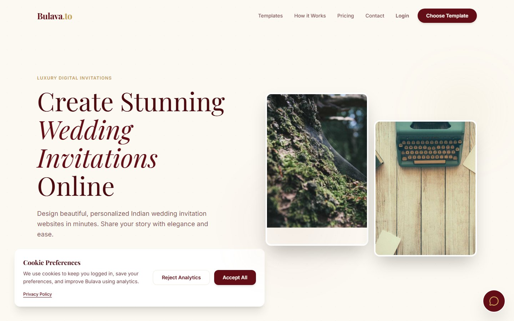
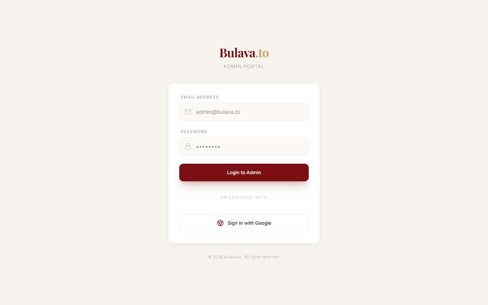

# Bulava.to

**Type:** Shipped product · **Scope:** Client site + Admin portal

A luxury digital wedding invitation platform — lets couples design and share personalized Indian wedding invitation websites. Built as two connected surfaces: the public template/builder site, and an internal admin portal.

## Client site

Warm, editorial landing page (serif logotype, maroon-on-cream palette) selling the core promise: "Create Stunning Wedding Invitations Online" in minutes.

## Admin portal

A separate authenticated portal for managing the platform — orders, templates, and accounts — styled consistently with the client-facing brand rather than a generic admin theme.

## Notes

- Backend runs on Firebase (Firestore, Functions).
- Built with React/Vite/TypeScript.
