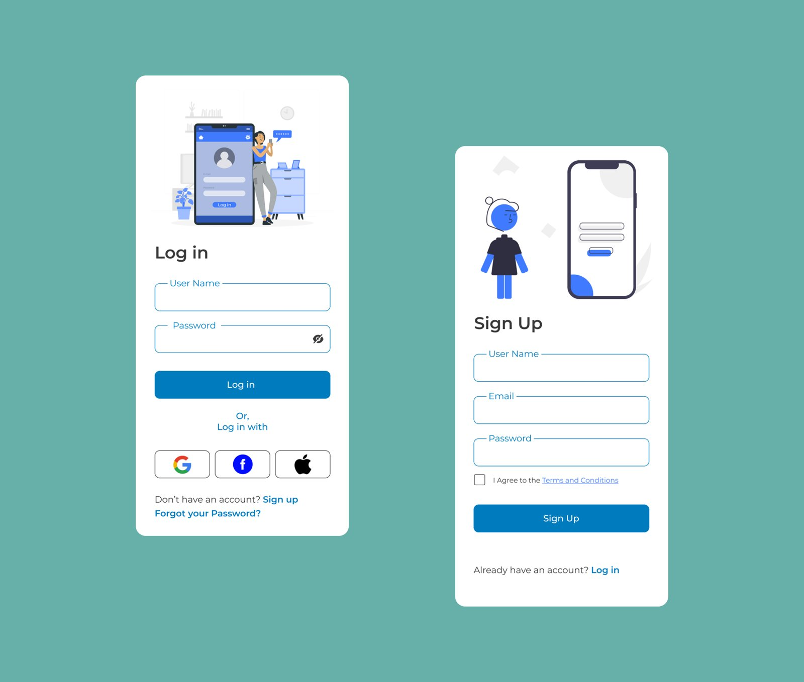

# Daily UI Challenge

**Type:** Design exercise (Figma) · **Scope:** Day 1–9

A running set of UI exercises in the style of the "Daily UI" challenge — one screen per day, each tackling a different common UI pattern (login, sign up, and onward through Day 9).

## Day 1 — Log in · Day 2 — Sign up

Consistent illustration style and component language (rounded inputs, single accent blue) carried across both screens.

## Notes

- Good showcase of range and consistency — same design system held across many small, self-contained problems rather than one large flow.

**Figma file:** https://www.figma.com/design/N8V3yzesguyQ1dGUYwB7T1/
