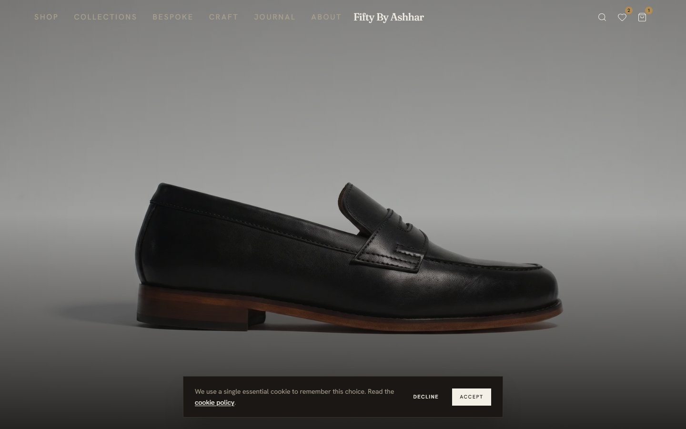
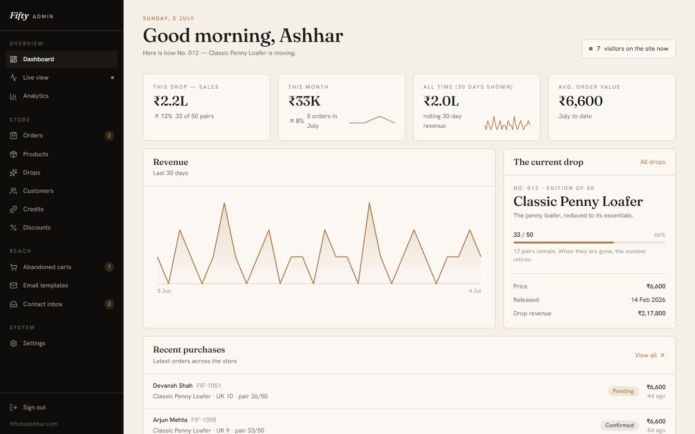
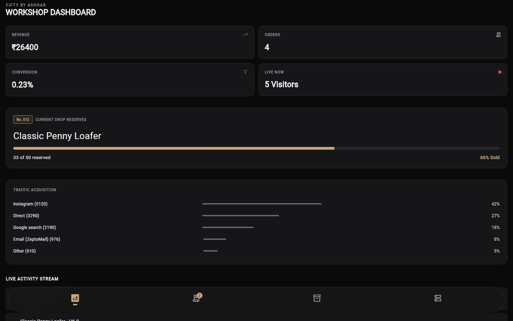

# Fifty By Ashhar

**Type:** Shipped product · **Scope:** Storefront + Admin dashboard + Internal ops app

A bespoke leather footwear brand sold in limited "drops" (e.g. "No. 012 — Classic Penny Loafer, Edition of 50"). The product spans three connected surfaces: a customer-facing storefront, an admin dashboard for running the business, and a workshop app for tracking production in real time.

## Storefront

Product-first, editorial layout — full-bleed shoe photography, minimal chrome, a persistent cart/wishlist.

## Admin dashboard

Day-to-day operations: revenue and order tracking, drop progress ("33 of 50 reserved"), traffic sources, live visitor count.

## Workshop app

A companion app (built with Flutter) for the workshop floor — same drop-progress and revenue data, in a darker, denser layout suited to an internal ops screen rather than a customer-facing one.

## Notes

- The three surfaces share a visual language (serif wordmark, warm neutral palette) while each is tuned for its own context — browsing/buying, running the business, and floor operations.
- Built with React/Vite (storefront + admin) and Flutter (workshop app).
