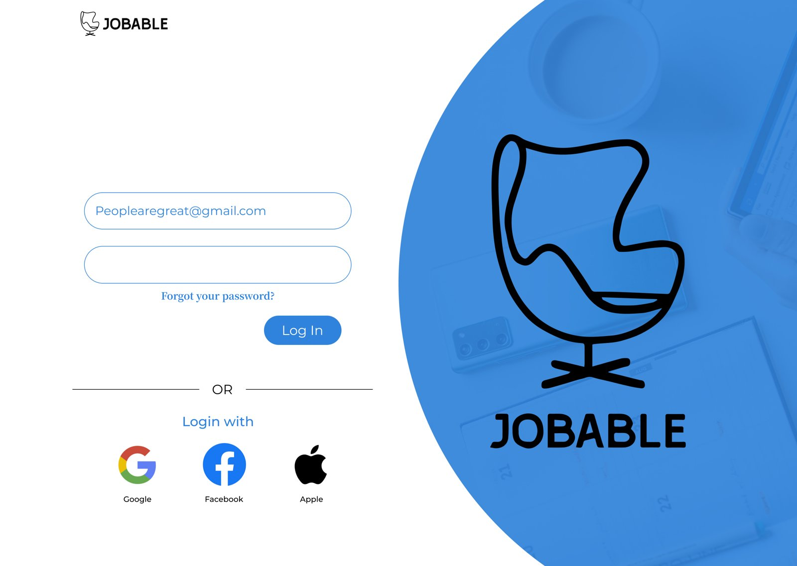

# JOBABLE — Job Search & Application Platform

**Type:** UX case study (Figma) · **Scope:** Web + Mobile, Wireframe → Mockup

A job search and application platform designed across both web and mobile, covering login, search, job details, and the application flow. The Figma file shows the progression from wireframe to finished mockup across three pages: "web desktop," "mobile app," and "web mobile."

## Login

Split-screen layout — form on one side, a brand illustration (the "Jobable" chair mark) on the other, with social login options.

## Process

- **Wireframes** establish the core flows: landing, login, search, job application, account.
- **Mockups** ("Hi-Login," "Hi-Landing," "Hi-Search") apply the final visual design to the same flows.
- The mobile app covers the full application journey: job description → resume upload → application submitted.

## Notes

- Three separate page groupings in the file suggest iteration across web desktop, native mobile, and responsive web — useful for comparing how the same flows adapt across surfaces.

**Figma file:** https://www.figma.com/design/mGqdW6CP1q08Hz1YkK5774/
