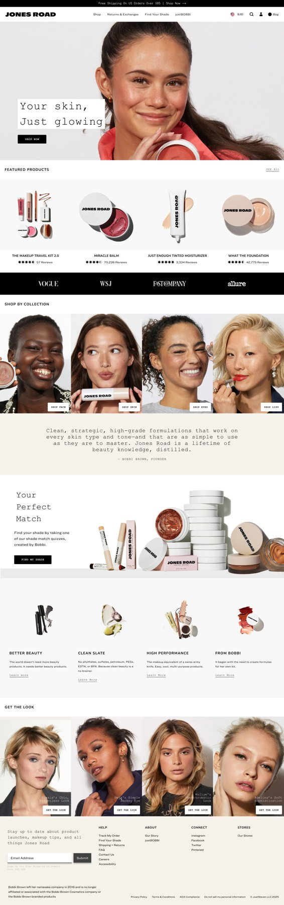

# Jones Road — UX Audit & Heatmap Analysis

**Type:** Design exercise / test (Figma) · **Scope:** UX audit

A UX audit exercise built around the existing Jones Road (a real cosmetics/beauty e-commerce brand) website — annotating the current site with heatmap-style analysis as a basis for redesign recommendations. The file is explicitly labeled as a design test/assignment.

## Notes

- This is an **audit of an existing third-party site**, not an original product design — included here to show UX-research and critique skills (identifying friction points from real usage/attention data) rather than visual design work.
- Frame labels in the file ("Heat Maps," "Current Version," "Content") indicate the audit was structured around specific page sections rather than a general review.

**Figma file:** https://www.figma.com/design/tMTq5on1cq7AVoUTvfQX8O/
