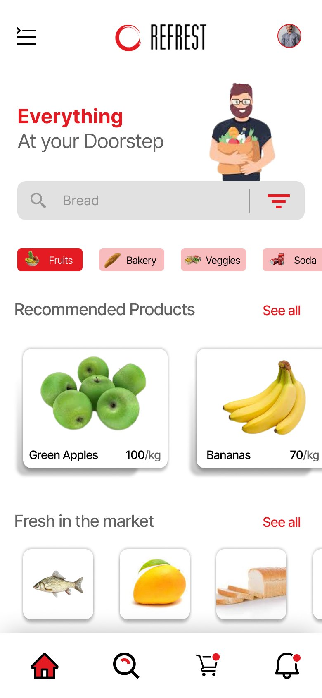

# REFREST — Grocery Delivery App

**Type:** UX case study (Figma) · **Scope:** Research → Wireframes → Hi-fi UI

An end-to-end case study for a grocery delivery app ("Everything at your doorstep"), covering the full process from user research through to a polished mobile UI.

## Process

The Figma file is organized as a real design process, not just screens:

- **User research** — a persona and a written problem statement anchor the rest of the design decisions.
- **Wireframes** — low-fidelity structure for the core flows before visual design.
- **Hi-fi UI** — a full mobile app: home/browse, category filters, recommended products, search, cart, and account.

## Home screen

Category shortcuts (Fruits, Bakery, Veggies, Soda), recommended products, and a "Fresh in the market" section — optimized for fast re-ordering of everyday items.

## Notes

- Figma file also includes a second assignment page with additional flows.

**Figma file:** https://www.figma.com/design/IFo2dxaouXo0BVl67VsDoK/
