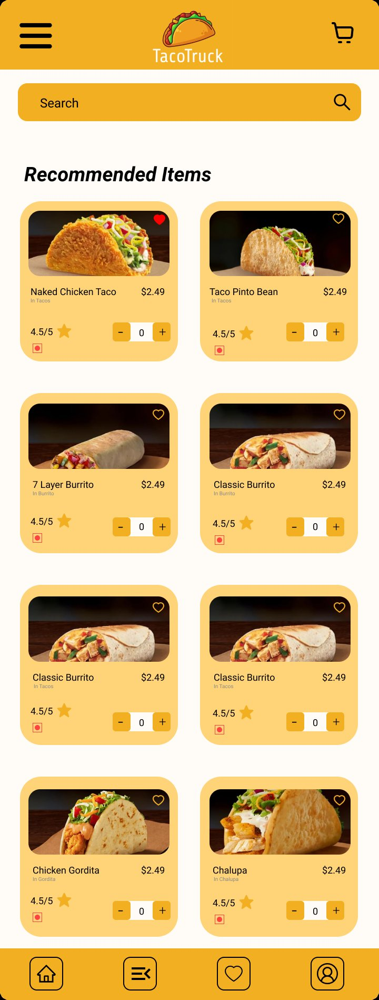
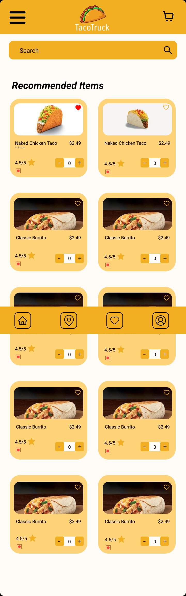

# TacoTruck — Food Ordering App

**Type:** UX case study (Figma) · **Scope:** Mobile, Wireframe → Prototype

A mobile food-ordering app for a taco truck brand, taken from low-fidelity wireframes through to an interactive prototype and final screens (menu browsing, cart, checkout, order confirmation).

## Wireframe → Prototype

The first Figma file tracks the process explicitly: a "Wireframe" page (structure only) followed by a "prototype" page (same flows, connected and styled).

## Final screens

Menu browsing with recommended items, ratings, and quantity steppers, in the brand's warm yellow palette.

## Notes

- Two Figma files cover this project: one focused on the wireframe→prototype process, the other on the finished screen set.

**Figma files:** https://www.figma.com/design/24QzbJt77knqvWxM6xIIHj/ · https://www.figma.com/design/uiw6vX40xq47zAd60zWByY/
