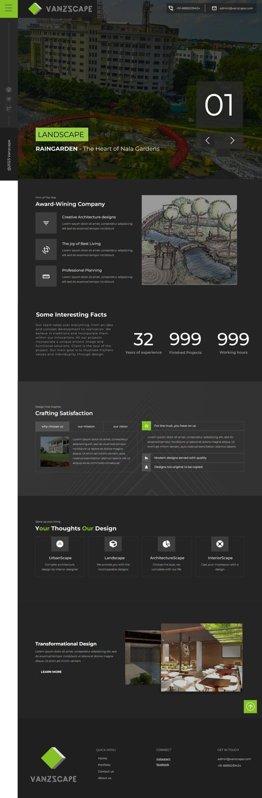

# Vanscape — Landscaping Business Website

**Type:** UX case study (Figma) · **Scope:** Marketing website

A website concept for a landscaping/outdoor design business ("Vanscape"), covering home, portfolio, services, about, and contact.

## Notes

- File includes a mood board page alongside the final prototype, suggesting the visual direction (palette, imagery style) was established before screen design.
- Structured as a typical small-business marketing site: Home → Portfolio → Services → About → Contact.

**Figma file:** https://www.figma.com/design/TmWLWIvMV9zTMhdBIGVwzm/
