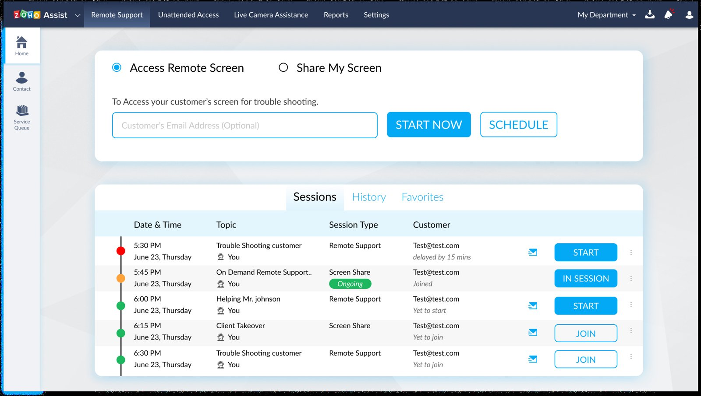

# Zoho Assist — Remote Support Dashboard Redesign

**Type:** UX case study / UI exploration (Figma) · **Scope:** Dashboard redesign + presentation

A redesign exploration of Zoho Assist's remote-support dashboard — the "Access Remote Screen" / "Share My Screen" home view, session list (Sessions / History / Favorites), and supporting components ("Client information," "Enter your action").

## Notes

- The Figma file includes a 15-slide presentation deck alongside the screens — this looks like it was packaged up to walk someone through the redesign rationale, not just deliver final screens.
- Good example of working within an existing product's information architecture rather than designing from a blank slate.

**Figma file:** https://www.figma.com/design/SoZV6g0ZE06hZEUKbLHAor/
